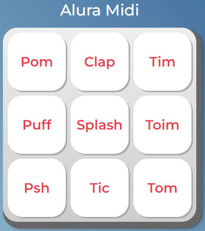

<h1>
  <a href="https://wendell95araujo.github.io/aluramidi/"></a>
  <p>Alura MIDI</p>
</h1>


O Alura MIDI é um instrumento musical de interface digitial (MIDI), que reproduz sons de instrumentos musicais, por enquanto de uma bateria, ao usuário clicar ou pressionar com teclado em seus botões.

<a href="https://wendell95araujo.github.io/aluramidi/"></a>

<h2>🔨 Funcionalidades do projeto</h2>

O MIDI tem um teclado digitial com 9 botões, cada botão reproduzirá o som de dado instrumento musical. O HTML carregará os arquivos de mídia com o som dos instrumentos através do elemento ``<audio>``, e com o MIDI vamos controlar a reprodução destes arquivos de mídia através do clique em seus elementos ``<button>``. Serão 9 sons diferentes.

>Para acessar a página [clique aqui](https://wendell95araujo.github.io/aluramidi/)

<h2>✔️ Técnicas e tecnologias utilizadas</h2>

- ``HTML5``
- ``CSS3``
- ``JS``

<h2>📁 Acesso ao projeto</h2>

>Para acessar a página [clique aqui](https://wendell95araujo.github.io/aluramidi/)

Neste repositório você tem acesso a todo o material produzido no curso.

<h2>🛠️ Abrir e rodar o projeto</h2>

Para abrir e rodar o projeto, basta abrir o aquivo index.html no navegador.

<h2>📚 Mais informações do curso</h2>

```
Curso Alura JavaScript para Web: Crie páginas dinâmicas
```
<h3>Instrutor</h3>

[<br><sub>Vanessa Me Tonini</sub>](https://github.com/vanessametonini)
:---: 

